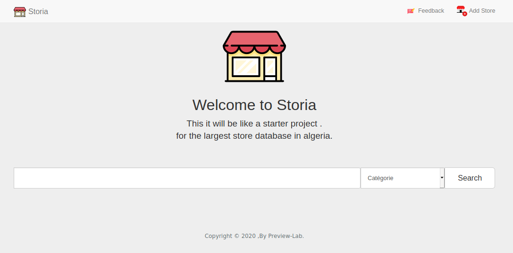
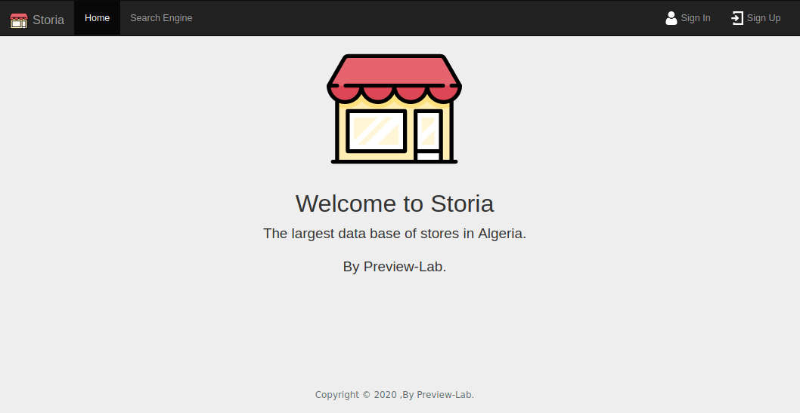
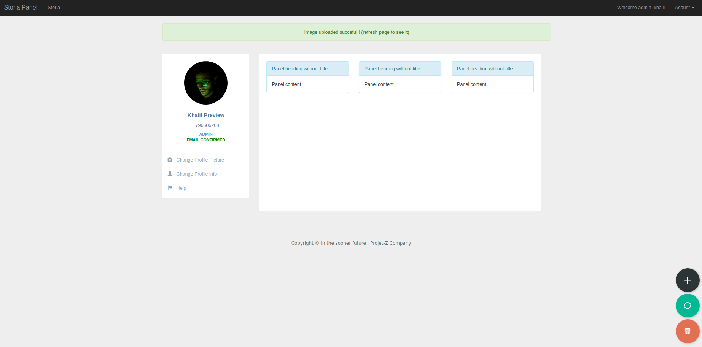
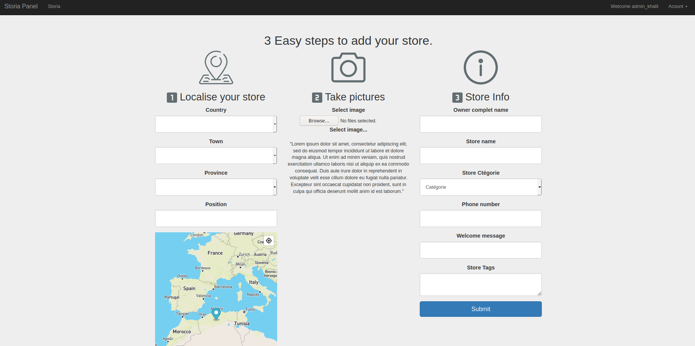

# Storia

> Easy way to find Stores (Storia make you shopping easier)
> > A smaill project i was working on 2 years ago, i am sharing that just for learning purpose. 

> Open config file config.cfg and put your keys here: 

`# google recaptcha config` 
`RECAPTCHA_PUBLIC_KEY= YOUR KEY HERE` 
`RECAPTCHA_PRIVATE_KEY= YOUR KEY HERE`  

`# config app and googlemaps`  
`GOOGLEMAPS_KEY = YOUR KEY HERE`  

## Run

1- activate the vertual env:  
linux: `source venv/bin/activate`

2- install the requirments:  
`pip install requirements.txt`

3- run the flask server:  
`python3 run_app.py`

4- create the database:  
`python3` 
`from app import db` 
`db.create.all()`

## Screenshots

